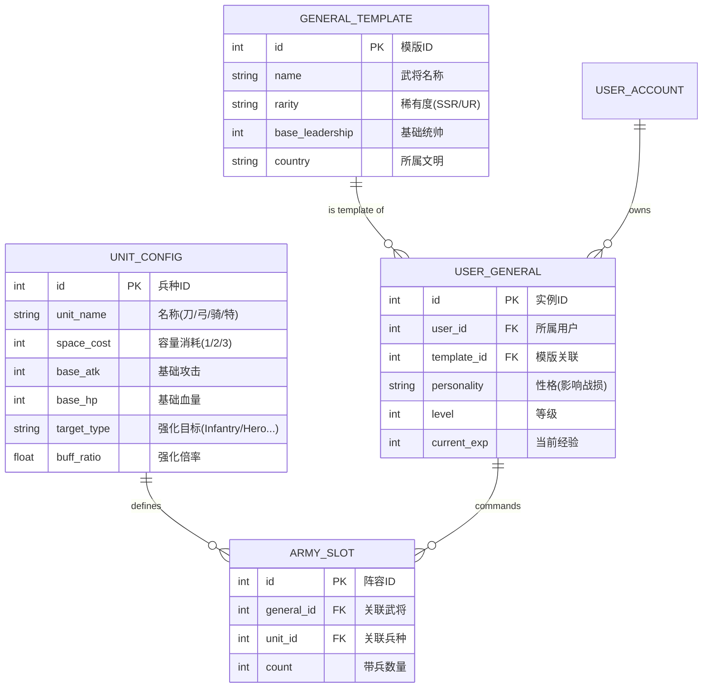

```mermaid
erDiagram
    GENERAL_TEMPLATE ||--o{ USER_GENERAL : "is template of"
    USER_ACCOUNT ||--o{ USER_GENERAL : "owns"
    UNIT_CONFIG ||--o{ ARMY_SLOT : "defines"
    USER_GENERAL ||--o{ ARMY_SLOT : "commands"

    GENERAL_TEMPLATE {
        int id PK "模版ID"
        string name "武将名称"
        string rarity "稀有度(SSR/UR)"
        int base_leadership "基础统帅"
        string country "所属文明"
    }

    USER_GENERAL {
        int id PK "实例ID"
        int user_id FK "所属用户"
        int template_id FK "模版关联"
        string personality "性格(影响战损)"
        int level "等级"
        int current_exp "当前经验"
    }

    UNIT_CONFIG {
        int id PK "兵种ID"
        string unit_name "名称(刀/弓/骑/特)"
        int space_cost "容量消耗(1/2/3)"
        int base_atk "基础攻击"
        int base_hp "基础血量"
        string target_type "强化目标(Infantry/Hero...)"
        float buff_ratio "强化倍率"
    }

    ARMY_SLOT {
        int id PK "阵容ID"
        int general_id FK "关联武将"
        int unit_id FK "关联兵种"
        int count "带兵数量"
    }
```