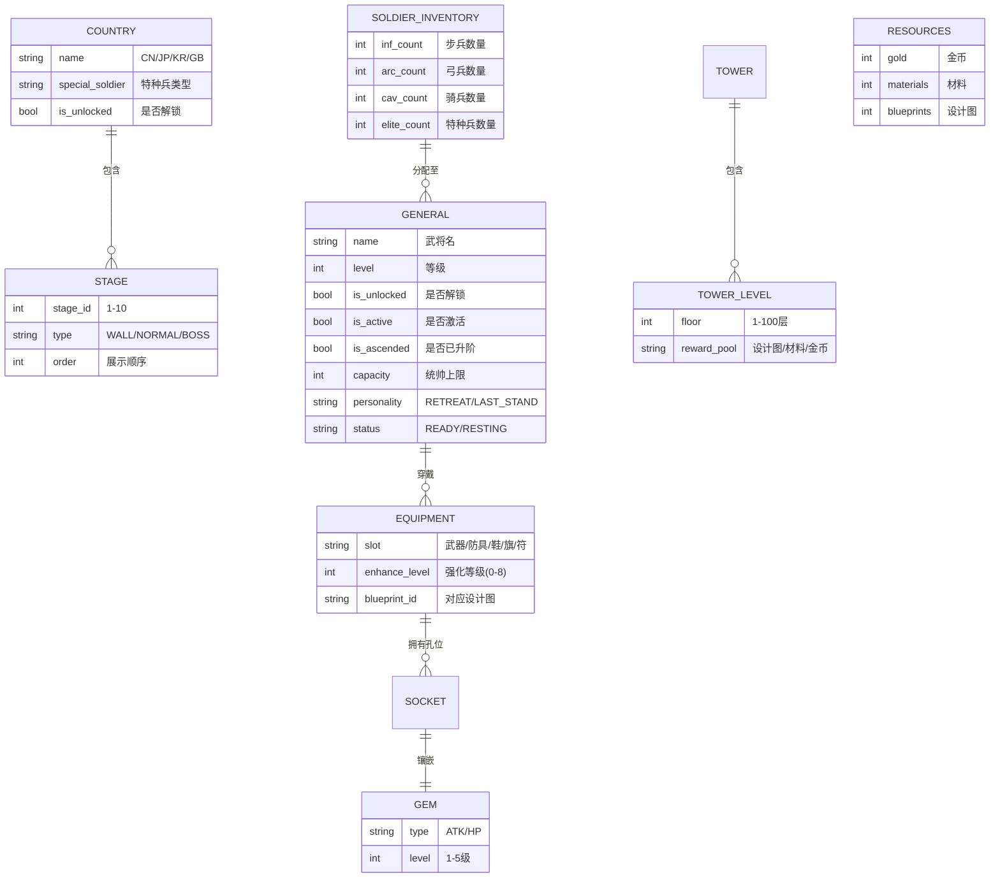

```mermaid
erDiagram
%% 核心国家与关卡
    COUNTRY ||--o{ STAGE : "包含"
    COUNTRY {
        string name "CN/JP/KR/GB"
        string special_soldier "特种兵类型"
        bool is_unlocked "是否解锁"
    }

    STAGE {
        int stage_id "1-10"
        string type "WALL/NORMAL/BOSS"
        int order "展示顺序"
    }

%% 武将系统
    GENERAL ||--o{ EQUIPMENT : "穿戴"
    GENERAL {
        string name "武将名"
        int level "等级"
        bool is_unlocked "是否解锁"
        bool is_active "是否激活"
        bool is_ascended "是否已升阶"
        int capacity "统帅上限"
        string personality "RETREAT/LAST_STAND"
        string status "READY/RESTING"
    }

%% 士兵系统
    SOLDIER_INVENTORY ||--o{ GENERAL : "分配至"
    SOLDIER_INVENTORY {
        int inf_count "步兵数量"
        int arc_count "弓兵数量"
        int cav_count "骑兵数量"
        int elite_count "特种兵数量"
    }

%% 装备与养成
    EQUIPMENT ||--o{ SOCKET : "拥有孔位"
    EQUIPMENT {
        string slot "武器/防具/鞋/旗/符"
        int enhance_level "强化等级(0-8)"
        string blueprint_id "对应设计图"
    }

    SOCKET ||--|| GEM : "镶嵌"
    GEM {
        string type "ATK/HP"
        int level "1-5级"
    }

%% 爬塔模式
    TOWER ||--o{ TOWER_LEVEL : "包含"
    TOWER_LEVEL {
        int floor "1-100层"
        string reward_pool "设计图/材料/金币"
    }

%% 资源类 (非实体，但在逻辑中重要)
    RESOURCES {
        int gold "金币"
        int materials "材料"
        int blueprints "设计图"
    }
```